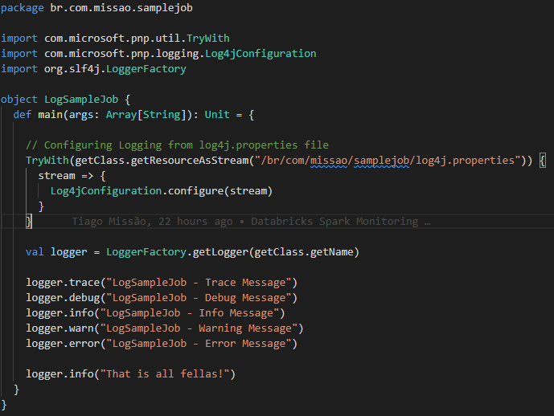

# Databricks Sparking Monitoring

The main purpose of this project is to enable monitoring on [Databricks](https://databricks.com/), in other words, is desired to retrieve its logs and metrics from databricks apps (jobs and workbooks) and send them to [Azure Log Analytics](https://docs.microsoft.com/en-us/azure/azure-monitor/logs/log-analytics-overview).


Most of this work was inspired by the [mspnp spark-monitoring repository](https://databricks.com/) and automatized using [Terraform](https://www.terraform.io/). So, all the heavy work is done!

## Before Beginning
---

The `Spark Libraries` used in this project was built through [mspnp spark-monitoring repository](https://databricks.com/), so if you want rebuild them there is no problem, just place the jars under the [libs folder](./artifacts/libs/) and if necessary correct their names in the terraform variable `spark_libs_names` located at [variables.tf file](./src/variables.tf). This is the command used to build them:

```bash
git clone https://github.com/mspnp/spark-monitoring
cd spark-monitoring
docker run -it --rm -v `pwd`:/spark-monitoring -v "$HOME/.m2":/root/.m2 mcr.microsoft.com/java/maven:8-zulu-debian10 /spark-monitoring/build.sh

```

After that, just move the generated jars under `spark-monitoring/src/target` to [`artifacts/libs`](./artifacts/libs/) folder of this project. 

> Do not forget to fix the jars names if necessary!

Also, a [sample job](./artifacts/sample/spark-sample-job/src/main/scala/br/com/missao/samplejob/LogSampleJob.scala) was developed using Scala, in that way, it is possible to show how to properly use the library



For the sample job, I used `scala-2.12_spark-3.1.2` profile, so the `.jar` file could be built through this command:

```bash
docker run -it --rm -v `pwd`/artifacts/sample/spark-sample-job:/spark-sample-job -v "$HOME/.m2":/root/.m2 -w /spark-sample-job mcr.microsoft.com/java/maven:8-zulu-debian10 mvn install -P "scala-2.12_spark-3.1.2"
```

The following profiles could be used:
- scala-2.11_spark-2.4.5
- scala-2.12_spark-3.0.1
- scala-2.12_spark-3.1.2
- scala-2.12_spark-3.2.0

However, if other profile was used, be sure to update the terraform variable `databrick` located at [variables.tf file](./src/variables.tf) to match the scala and spark version used. Otherwise, the Databricks cluster will not be compatible and the job will fail.

Once the build process finish, a file named `spark-sample-job-0.0.1.jar` will be created under [target folder](./artifacts/sample/spark-sample-job/target/).
## Setup
---

- [Create an Azure Account](https://azure.microsoft.com/en-us/free/)
- [Install TF_ENV](https://github.com/tfutils/tfenv)


## Usage
---

```bash
cd src
az login
tfenv install
tfenv use
terraform init
terraform apply
```
## Result
---


## Extra
---

This is how you can used the library with a Notebook

```scala
%scala
import com.microsoft.pnp.util.TryWith
import com.microsoft.pnp.logging.Log4jConfiguration
import java.io.ByteArrayInputStream
import org.slf4j.LoggerFactory

val className = getClass.getName
val log4jConfig = s"""
log4j.appender.logAnalytics=com.microsoft.pnp.logging.loganalytics.LogAnalyticsAppender
log4j.appender.logAnalytics.layout=com.microsoft.pnp.logging.JSONLayout
log4j.appender.logAnalytics.layout.LocationInfo=false
log4j.additivity.$className=false
log4j.logger.$className=INFO, logAnalytics
"""

TryWith(new ByteArrayInputStream(log4jConfig.getBytes())) {
  stream => {
    Log4jConfiguration.configure(stream)
  }
}

val logger = LoggerFactory.getLogger(getClass)
logger.info("Info message")
logger.warn("Warn message")
logger.error("Error message")
```
## References
---

- [`Microsoft Tutorial`](https://docs.microsoft.com/en-us/azure/architecture/databricks-monitoring/application-logs)

- [`mspnp-spark-monitoring`](https://github.com/mspnp/spark-monitoring)

- [`Video Tutorial`](https://www.youtube.com/watch?v=fktz63uDzM4&ab_channel=DustinVannoy)
